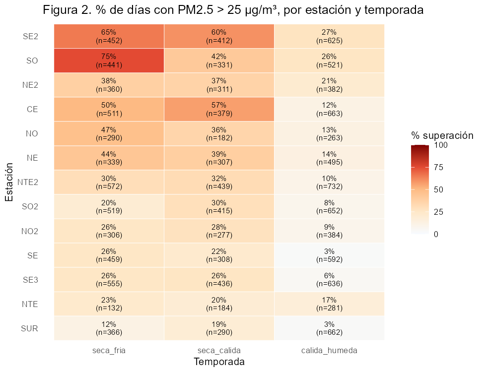
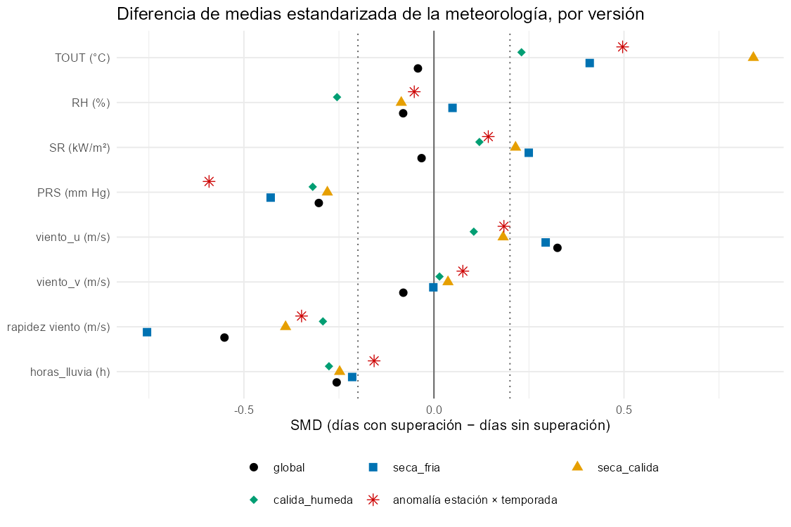
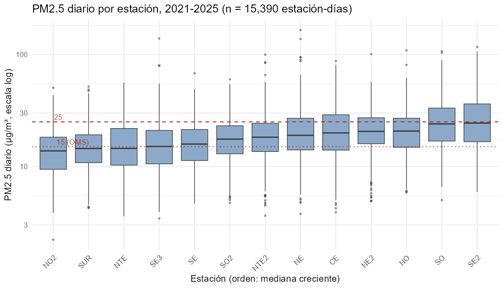
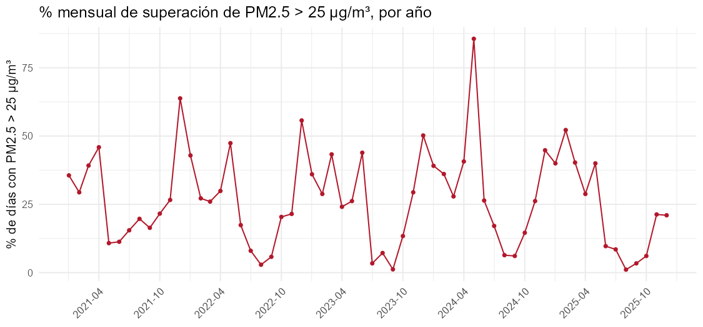
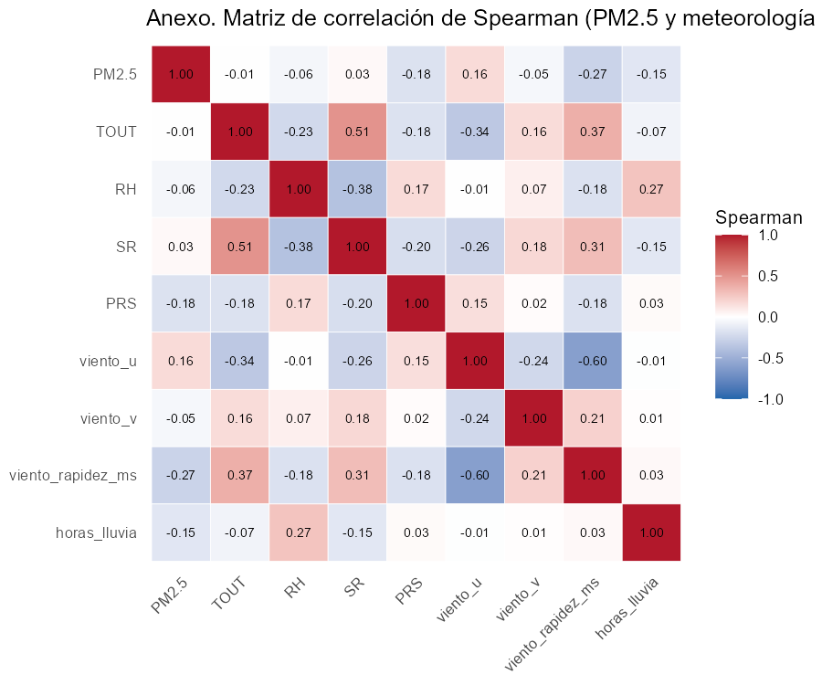

```{r}
#| label: setup
suppressPackageStartupMessages({
  library(data.table)
  library(knitr)
})
E2 <- "output/etapa2/"
miles <- function(x) formatC(x, format = "d", big.mark = " ")
```

**Nombres y matrículas**

Nombre completo: \_\_\_\_\_\_\_\_\_\_\_\_\_\_\_\_\_\_\_\_\_\_\_\_\_\_\_\_  Matrícula: \_\_\_\_\_\_\_\_\_\_\_\_\_\_

Nombre completo: \_\_\_\_\_\_\_\_\_\_\_\_\_\_\_\_\_\_\_\_\_\_\_\_\_\_\_\_  Matrícula: \_\_\_\_\_\_\_\_\_\_\_\_\_\_

Nombre completo: \_\_\_\_\_\_\_\_\_\_\_\_\_\_\_\_\_\_\_\_\_\_\_\_\_\_\_\_  Matrícula: \_\_\_\_\_\_\_\_\_\_\_\_\_\_

Nombre completo: \_\_\_\_\_\_\_\_\_\_\_\_\_\_\_\_\_\_\_\_\_\_\_\_\_\_\_\_  Matrícula: \_\_\_\_\_\_\_\_\_\_\_\_\_\_

Curso: Análisis multivariado (MA2003B)

Profesor(a):

Fecha de entrega:




# 1. Objetivo de indagación

En la etapa 1 propusimos identificar regímenes multicontaminante con conglomerados. La retroalimentación señaló que era demasiado ambicioso para tres semanas, y coincidimos: un análisis no supervisado exige muchas decisiones de diseño (número de grupos, distancia, variables) sin un criterio externo para validarlas. Reenfocamos el trabajo en un desenlace con significado sanitario y una respuesta medible, conservando la base limpia, las temporadas y el periodo 2021–2025 de la etapa 1. El PM2.5 es el contaminante con mayor evidencia de daño por exposición de corto plazo (Orellano et al., 2020; World Health Organization [WHO], 2021) y en la ZMM rebasa con frecuencia los valores normativos (Hernández-Romero et al., 2026).

**Pregunta.** ¿En qué medida la meteorología del día mejora la clasificación retrospectiva de los días-estación con PM2.5 promedio de 24 h superior a 25 µg/m³, respecto de un modelo que solo considera la estación de monitoreo y la temporada, en 13 estaciones de la ZMM durante 2021–2025?

**Objetivo general.** Estimar y comparar, con validación temporal, dos modelos de análisis discriminante lineal (LDA): M0, con estación y temporada, y M1, que añade ocho variables meteorológicas del mismo día. La mejora se cuantifica con la diferencia de AUC (ΔAUC) y de exactitud balanceada, con intervalos por bootstrap. **Objetivos específicos:** (1) describir la distribución de las superaciones por estación, temporada y año, y (2) describir cómo difiere la meteorología de los días con y sin superación dentro de cada estación y temporada (esta etapa); (3) estimar M0 y M1 y la incertidumbre de ΔAUC (etapa 3).

**Sobre el umbral.** 25 µg/m³ es el límite de 24 h del quinto año de aplicación de la NOM-025-SSA1-2021 (Secretaría de Salud, 2021). Lo usamos como referencia fija para todo el periodo, no como evaluación del cumplimiento histórico, porque los límites vigentes cambiaron entre 2021 y 2025. El resultado describe concentraciones, no riesgo individual: por debajo de 25 µg/m³ el riesgo no es nulo (WHO, 2021).

# 2. Ruta de análisis

La partición, las métricas y las sensibilidades quedaron fijadas en un protocolo escrito antes de ajustar cualquier modelo (`docs/etapa2/protocolo.md`), para no elegir el análisis según el resultado. La @tbl-ruta resume la ruta.

| Técnica (etapa) | Rol | Justificación |
|---|---|---|
| Proporciones de superación, diferencia de medias estandarizada (SMD) y Spearman (2) | Describir el desenlace y anticipar qué variables separan las clases | El SMD no depende de *n* ni de las unidades (Austin, 2009); Spearman tolera la asimetría |
| Componentes principales de la meteorología (3) | Exploratorio: nombrar los ejes meteorológicos | Hay colinealidad (Sección 4.3); maximizar varianza no garantiza separar clases, por eso no es el predictor principal |
| LDA, M0 frente a M1 (3) | Técnica principal | Combinación lineal interpretable; precedente en redes de monitoreo (Mohd Shafi'i & Juahir, 2024); supuestos revisados (Johnson & Wichern, 2007) |
| Regresión logística (3) | Solo robustez | Verifica que la conclusión no dependa del LDA |
| Entrenamiento 2021–2023, prueba 2024–2025 y bootstrap por bloques de 14 días (3) | Desempeño fuera de muestra e incertidumbre | La prueba se usa una sola vez; los bloques conservan juntas las estaciones porque un episodio afecta a varias |

: Ruta de análisis. {#tbl-ruta}

**Variables.** La respuesta es `supera_25` (1 si el PM2.5 diario es mayor de 25 µg/m³). M0 usa la estación (13 categorías) y la temporada: seca-fría (nov–feb), seca-cálida (mar–may) y cálida-húmeda (jun–oct). M1 añade temperatura (TOUT), humedad relativa (RH), radiación solar (SR), presión (PRS), viento como componentes zonal (*u*) y meridional (*v*) y como rapidez (m/s), y horas con lluvia. El año sirve para la partición y `supera_15` (guía de la OMS) para sensibilidad. Excluimos a propósito los demás contaminantes, porque comparten fuentes con el PM2.5 y son en parte co-desenlaces; la dirección del viento en grados, sustituida por *u* y *v*; y la lluvia en milímetros, cuya unidad no está confirmada.

# 3. Datos y papel de la estación

La unidad es el estación-día. Exigimos PM2.5 diario con al menos 18 h válidas (criterio de SIMA) y los ocho predictores meteorológicos completos con el mismo criterio. NE3 y NO3 se excluyen porque casi no miden PM2.5. De 23 738 estación-días posibles quedan **15 390 (64.8 %)**: 3 820 fallan por PM2.5, 5 763 por meteorología y 1 235 por ambas (Anexo A1).

**La estación** entra como variable categórica en M0 y M1 y absorbe las diferencias persistentes entre sitios: fuentes cercanas, topografía y altitud. Tres consecuencias guían el análisis. Primero, la presión cruda no es comparable entre estaciones: su media va de 701 mm Hg (NO2, SO) a 731 mm Hg (SE3) por la altitud; por eso la meteorología también se describe como anomalía respecto de su estación y temporada (Sección 4.2). Segundo, las estaciones no pesan igual: la retención va de 28 % (NO2) a 95.5 % (NTE2). Tercero, exigir meteorología completa no es neutral: la superación global casi no cambia (25.7 % con solo PM2.5 válido frente a 26.3 %), pero en NO2 baja de 18.2 % a 10.0 %: en esa estación, los días sin radiación válida superan 25 µg/m³ en 24.6 % y los días con radiación válida, en 8.5 %. Por ello agregamos como sensibilidad estimar M0 también en la muestra con solo PM2.5 válido (19 918 días).

**Hallazgo de calidad y regla nueva.** La exploración reveló valores imposibles que las reglas de la etapa 1 no detectaban: promedios diarios de viento de hasta 33 m/s (≈ 119 km/h) en SO2 (jun–oct 2021) y NE2 (nov–dic 2021), cuando la mediana horaria de la red rondaba 10 km/h, y radiación solar distinta de cero de noche (hasta 0.7 kW/m² entre 00 y 04 h), sobre todo en NO2, SE3 y CE. La etapa 1 había excluido a SR de la regla de rachas porque sus ceros nocturnos son reales. Siguiendo procedimientos de consistencia para estaciones automáticas (Estévez et al., 2011; Fiebrich et al., 2010), invalidamos SR en los días con promedio nocturno mayor de 0.02 kW/m², y el viento en las horas que exceden en más de 30 km/h a la mediana de la red (con al menos cinco estaciones), extendiendo la invalidación a todo el día cuando hay tres o más horas marcadas. Los umbrales son decisión del equipo, apoyada en la distribución observada (el promedio nocturno de SR pasa de 0.004 a 0.037 kW/m² entre los percentiles 90 y 95); el análisis de sensibilidad está en el repositorio. La regla retira 1 070 estación-días, y el viento diario máximo queda en 7.3 m/s. El perfil horario de la radiación confirma, además, que las horas están en tiempo local.

**Sensibilidad a la imputación.** Si el PM2.5 diario se calcula solo con horas observadas, el 2.8 % de los días deja de ser evaluable y el 0.7 % de los comparables cambia de clase: la imputación de huecos de hasta 3 h no altera la respuesta de forma apreciable.

# 4. Exploración descriptiva

## 4.1 Distribución de las superaciones

El 26.3 % de los estación-días supera 25 µg/m³. La mediana del PM2.5 diario es 18.2 µg/m³, con asimetría positiva (2.0) y episodios de hasta 166 µg/m³ (Anexo A2). La superación es mucho más frecuente en las temporadas secas (37.2 % en seca-fría y 35.5 % en seca-cálida) que en la cálida-húmeda (12.4 %), lo que es coherente con los vientos débiles y la menor altura de mezcla asociados a la época fría en la ZMM (Martínez-Cinco et al., 2016). Entre años varía poco (24.0–29.7 %) y sin tendencia (Anexo A3). La @fig-superacion muestra un gradiente espacial amplio: SE2 y SO superan en casi la mitad de sus días y SUR en menos del 10 %. El patrón estacional, además, cambia según la estación: SO pasa de 75 % en seca-fría a 42 % en seca-cálida, CE alcanza su máximo en seca-cálida (55 %) y NTE casi no varía (17–23 %).

*Interpretación.* Estación y temporada separan por sí solas buena parte de los días con superación, de modo que M0 es una referencia exigente y el aporte de la meteorología se mide sobre ese piso. La interacción estación × temporada sugiere que un M0 aditivo podría subestimar la referencia; por eso la registramos en el protocolo como sensibilidad antes de ajustar.

{#fig-superacion width="4.6in"}

## 4.2 Meteorología de los días con superación

La @fig-smd compara las dos clases con el SMD en tres versiones: global, dentro de cada temporada y como anomalía (cada valor menos la media de su estación y temporada). La última es la que corresponde a la pregunta, porque mide lo que la meteorología añade cuando estación y temporada ya se conocen.

- **Temperatura.** En el global casi no difiere (SMD −0.04), pero dentro de cada temporada los días con superación son más cálidos (0.23 a 0.84) y la anomalía alcanza 0.50. El efecto se cancela al agrupar porque la superación es más frecuente en la época fría: es una paradoja de Simpson, y explica por qué las correlaciones agrupadas con el PM2.5 son débiles (|ρ| ≤ 0.27; Anexo A4) sin que eso implique que la meteorología no aporte.
- **Viento.** Los días con superación tienen menos viento (−0.55 global; −0.35 como anomalía; −0.75 en seca-fría) y menos flujo del este (*u*, +0.32), lo que es consistente con una menor ventilación.
- **Presión.** Es el mayor contraste como anomalía (−0.59): presión más baja de lo normal para la estación y temporada. Junto con la temperatura más alta, sugiere condiciones previas al paso de frentes, pero es una hipótesis que estos datos no permiten verificar.
- **Lluvia** disminuye (−0.26 global), mientras que humedad, radiación y viento meridional casi no separan las clases (|SMD| ≤ 0.14 como anomalía).

*Interpretación.* Hay señal meteorológica condicional a estación y temporada, pero moderada (|SMD| ≤ 0.6) y con mucho traslape. Esperamos una mejora de M1 sobre M0 real pero acotada; una ΔAUC pequeña también sería un resultado informativo para SIMA.

{#fig-smd width="5in"}

## 4.3 Implicaciones para el modelado

Hay colinealidad entre predictores (*u* y rapidez, ρ = −0.61; TOUT y SR, ρ = 0.53), así que los coeficientes del LDA se interpretarán en conjunto y el PCA ayudará a nombrar los ejes meteorológicos. Las horas con lluvia (92 % de días en cero) y la rapidez del viento son muy asimétricas, lo que tensiona el supuesto de normalidad del LDA; las posibles transformaciones se decidirán solo con validación progresiva dentro de 2021–2023.

# 5. Síntesis

**Qué se descubrió.** La superación de 25 µg/m³ ocurre en uno de cada cuatro estación-días y depende sobre todo de la temporada y la estación, que además interactúan. Dentro de cada estación y temporada, los días con superación son más cálidos, con presión más baja, menos viento y menos lluvia. La exploración también detectó fallas de sensores que motivaron una regla de limpieza nueva.

**Relación con el objetivo.** Que estación y temporada separen tanto valida a M0 como referencia exigente; las diferencias meteorológicas condicionales (@fig-smd) indican que M1 tiene información adicional, y su magnitud anticipa una mejora moderada.

**Limitaciones.** La muestra no es aleatoria: la retención es desigual y la exigencia de meteorología completa altera la prevalencia de algunas estaciones (NO2). El umbral es una referencia fija y no una evaluación normativa. La meteorología del mismo día permite asociar, no anticipar. Días y estaciones son dependientes. No contamos con la altura de la capa de mezcla, y la unidad de la lluvia sigue por confirmar con SIMA.

**Análisis pendientes.** PCA exploratorio; M0 y M1 con LDA y validación progresiva; ΔAUC con bootstrap por bloques (sensibilidad con 7 y 28 días); logística como robustez; revisión de supuestos; y sensibilidades con 15 µg/m³, PM2.5 solo con horas observadas, componentes principales como predictores, interacción estación × temporada y M0 en la muestra con solo PM2.5 válido.

**Camino a seguir.** Modelos y validación en la etapa 3 (15 de octubre) y una aplicación sencilla para explorar los resultados por estación y temporada en la exposición (22 de octubre).

**Nuevas preguntas.** ¿El patrón de presión baja y temperatura alta corresponde a situaciones previas a frentes? ¿Cuánto añade el PM2.5 del día anterior? ¿Se conserva la mejora con meteorología pronosticada, que permitiría una alerta real? ¿Hay grupos de estaciones con sensibilidad meteorológica parecida?

**Repositorio.** https://github.com/Leo-issacs/reto-sima-multivariados (README, sección «Cómo reproducir»). **Uso de IA.** Usamos Claude y Codex para revisar código, proponer pruebas de calidad y editar la redacción; las decisiones, la verificación de cifras y la interpretación son del equipo (Anexo B).

# Referencias

::: {custom-style="Referencia"}

Austin, P. C. (2009). Balance diagnostics for comparing the distribution of baseline covariates between treatment groups in propensity-score matched samples. *Statistics in Medicine, 28*(25), 3083–3107. https://doi.org/10.1002/sim.3697

Estévez, J., Gavilán, P., & Giráldez, J. V. (2011). Guidelines on validation procedures for meteorological data from automatic weather stations. *Journal of Hydrology, 402*(1–2), 144–154. https://www.sciencedirect.com/science/article/pii/S0022169411001594

Fiebrich, C. A., Morgan, C. R., McCombs, A. G., Hall, P. K., & McPherson, R. A. (2010). Quality assurance procedures for mesoscale meteorological data. *Journal of Atmospheric and Oceanic Technology, 27*(10), 1565–1582. https://doi.org/10.1175/2010JTECHA1433.1

Hernández-Romero, K., Hernández-Romero, I. M., Mendoza, A., Pérez-Rodríguez, M., Barajas-Villarruel, L. R., Medellín-Carrillo, S., & González, L. T. (2026). Persistent air pollution regimes and regulatory exceedances of PM10, PM2.5, and O3 in the Monterrey Metropolitan Area, Mexico. *City and Environment Interactions, 31*, 100410. https://doi.org/10.1016/j.cacint.2026.100410

Johnson, R. A., & Wichern, D. W. (2007). *Applied multivariate statistical analysis* (6th ed.). Pearson.

Martínez-Cinco, M. A., Santos-Guzmán, J., & Mejía-Velázquez, G. M. (2016). Source apportionment of PM2.5 for supporting control strategies in the Monterrey Metropolitan Area, Mexico. *Journal of the Air & Waste Management Association, 66*(6), 631–642. https://doi.org/10.1080/10962247.2016.1159259

Mohd Shafi'i, M. S., & Juahir, H. (2024). Assessment of spatial air quality on the East Coast of Peninsular Malaysia utilizing environmetric techniques. *Environmental Monitoring and Assessment, 196*(7), 640. https://doi.org/10.1007/s10661-024-12787-9

Orellano, P., Reynoso, J., Quaranta, N., Bardach, A., & Ciapponi, A. (2020). Short-term exposure to particulate matter (PM10 and PM2.5), nitrogen dioxide (NO2), and ozone (O3) and all-cause and cause-specific mortality: Systematic review and meta-analysis. *Environment International, 142*, 105876. https://doi.org/10.1016/j.envint.2020.105876

Secretaría de Salud. (2021, 27 de octubre). NOM-025-SSA1-2021, Salud ambiental. Criterio para evaluar la calidad del aire ambiente, con respecto a las partículas suspendidas PM10 y PM2.5. *Diario Oficial de la Federación*.

World Health Organization. (2021). *WHO global air quality guidelines: Particulate matter (PM2.5 and PM10), ozone, nitrogen dioxide, sulfur dioxide and carbon monoxide*. https://www.who.int/publications/i/item/9789240034228

:::




# Anexo A. Tablas y figuras complementarias

## A1. Pérdidas de la muestra por requisito y retención por estación

```{r}
#| label: tbl-a1-perdidas
#| tbl-cap: "Pérdidas de la muestra por requisito, sobre los 23 738 estación-días posibles (13 estaciones × 2021–2025). Un día puede fallar más de un requisito."
p <- fread(paste0(E2, "perdidas_muestra.csv"), encoding = "UTF-8")
p[, n := miles(n)]
setnames(p, c("Requisito", "Estación-días", "% del universo"))
kable(p, align = c("l", "r", "r"))
```

```{r}
#| label: tbl-a1-retencion
#| tbl-cap: "Retención por estación: estación-días en la muestra sobre los 1 826 días de 2021–2025."
r <- fread(paste0(E2, "retencion_por_estacion.csv"), encoding = "UTF-8")
r[, `:=`(dias_totales = miles(dias_totales), dias_retenidos = miles(dias_retenidos))]
setnames(r, c("Estación", "Días posibles", "Días en la muestra", "% retenido"))
kable(r, align = c("l", "r", "r", "r"))
```

## A2. PM2.5 diario por estación

{#fig-a2-boxplot width="6.5in"}

## A3. Porcentaje mensual de superación por año

{#fig-a3-mensual width="6.5in"}

## A4. Matriz de correlación de Spearman

{#fig-a4-spearman width="5.5in"}

## A5. Descriptivos de PM2.5 y de los ocho predictores

```{r}
#| label: tbl-a5-descriptivos
#| tbl-cap: "Descriptivos de la muestra: n, media, desviación estándar (DE), cuartiles y asimetría. Extremos = valores mayores que Q3 + 3·IQR."
d <- fread(paste0(E2, "descriptivos_pm25_meteo.csv"), encoding = "UTF-8")
d <- d[, .(Variable = variable, n = miles(n), Media = sprintf("%.2f", media), DE = sprintf("%.2f", de),
           Q1 = sprintf("%.2f", q1), Mediana = sprintf("%.2f", mediana), Q3 = sprintf("%.2f", q3),
           Asimetría = sprintf("%.2f", asimetria), Extremos = extremos_mayores_q3_mas_3iqr)]
kable(d, align = c("l", rep("r", 8)))
```

## A6. Días retirados por la regla D15 (Sección 3), por estación

```{r}
#| label: tbl-a6-d15
#| tbl-cap: "Estación-días de la muestra retirados por la regla D15 (2021–2025, 13 estaciones). Un día puede caer en ambas pruebas. Las dos últimas columnas cuentan los días con al menos una hora invalidada por cada prueba."
d15 <- fread(paste0(E2, "anexo_d15_por_estacion.csv"), encoding = "UTF-8")
setnames(d15, c("Estación", "Días retirados", "Por SR nocturna", "Por viento", "Días con SR nocturna (M)", "Días con viento invalidado (E)"))
kable(d15, align = c("l", rep("r", 5)))
```



# Anexo B. Declaratoria de uso de IA (Opción B)

- **Herramientas:** Claude (Anthropic): Claude Opus y Claude Code; Codex (OpenAI).
- **Uso realizado:**
  - Claude Opus: reformulación de la pregunta tras la retroalimentación, protocolo de análisis, búsqueda de literatura, detección de las fallas de viento y radiación al revisar los descriptivos, y redacción y edición del texto.
  - Claude Code: scripts de R de limpieza (regla D15), validación, pruebas sintéticas, construcción de la muestra, descriptivos y figuras (`scripts/03` a `06`), y armado del documento en Quarto.
  - Codex: revisión independiente del protocolo y de cada solicitud de cambios (*pull request*) antes de integrarla.
- **Secciones:** todo el informe, `docs/etapa2/protocolo.md` y los scripts mencionados.
- **Validación realizada por los estudiantes:** [[COMPLETAR por el equipo con lo realmente revisado]]{.mark}.
- Confirmamos que revisamos y verificamos el contenido final y asumimos la responsabilidad sobre él.
